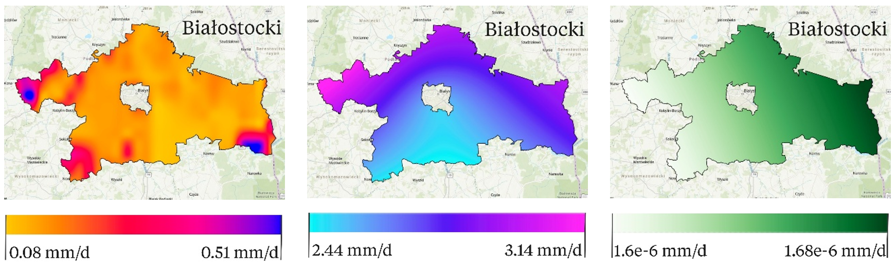

<h3>Welcome to An Open R Pipeline for Daily High-Resolution Hydroclimatic Raster Data Processing over Poland!</h3>
Built-in the AGH University of Science and Technology of Kraków 

Ⓜ️ yyara@agh.edu.pl  

<h3>Introduction</h3>

Welcome to the first open-source repository in Poland dedicated to the generation and processing of daily high-resolution hydroclimatic raster data, including evapotranspiration, precipitation, and runoff. This R-based pipeline allows users to generate and download raster datasets, discretized by powiaty (counties), ensuring 100% geographical coverage across the country. The data is processed on a daily basis and designed to support applications in hydrology, climate research, environmental monitoring, and more.  

⚠️ An article based on this repository has been submitted to a peer-reviewed, indexed scientific journal. The publication is currently under review and will be published soon. Stay tuned for updates!  

<h3>Key Features of the Repository</h3>
✔ Daily hydroclimatic raster data for Poland at county (powiat) level 
✔ Variables: precipitation, evapotranspiration, runoff 
✔ Modules: data download, interpolation, raster generation 
✔ User inputs: start date, end date, powiat name 
✔ Output: GeoTIFF rasters, ready for GIS 
✔ Built in R, modular and open-source   

🟢Features of the structured time indexed daily raster output from the pipeline.
| Hydroclimate Variable     | Format   | Data Type              | Temporal Window  | Spatial Resolution*  | Geoprocessing Method                   |
|---------------------------|----------|------------------------|------------------|----------------------|----------------------------------------|
| Evapotranspiration (mm/d) | .GeoTIFF | Dynamic time indexed   | Daily            | 30-meter pixel       | Multidimensional reduction             |
| Precipitation (mm/d)      | .GeoTIFF | Dynamic time indexed   | Daily            | 30-meter pixel       | Interpolation using Ordinary Kriging   |
| Runoff (mm/d)             | .GeoTIFF | Dynamic time indexed   | Daily            | 30-meter pixel       | Interpolation using Ordinary Kriging   |

Evapotranspiration, precipitation and runoff data are downloaded and generated from the EUMETSAT (2025), collected from synoptic meteorological stations operated by the Polish Institute of Meteorology and Water Management (Czernecki, et al., 202; IMGW-PIB, 2025) and downloaded using Google Earth Engine (GEE) from the ECMWF/ERA5_LAND/DAILY_AGGR dataset (ECMWF, 2025) respectively with a daily temporal resolution.   

🟢Output sample of the repository data downloaded Białostocki powiat (county) for September 23th, 2023. 

evapotranspiration&nbsp;&nbsp;&nbsp;&nbsp;&nbsp;&nbsp;&nbsp;&nbsp;&nbsp;&nbsp;&nbsp;&nbsp;&nbsp;&nbsp;&nbsp;&nbsp;&nbsp;&nbsp;&nbsp;&nbsp;&nbsp;&nbsp;&nbsp;&nbsp;&nbsp;&nbsp;&nbsp;&nbsp;&nbsp;&nbsp;&nbsp;&nbsp;&nbsp;&nbsp;&nbsp;&nbsp;&nbsp;&nbsp;&nbsp;&nbsp;&nbsp;&nbsp;&nbsp;&nbsp;&nbsp;&nbsp;&nbsp;&nbsp;&nbsp;&nbsp;&nbsp;&nbsp;&nbsp;&nbsp;&nbsp;&nbsp;precipitation&nbsp;&nbsp;&nbsp;&nbsp;&nbsp;&nbsp;&nbsp;&nbsp;&nbsp;&nbsp;&nbsp;&nbsp;&nbsp;&nbsp;&nbsp;&nbsp;&nbsp;&nbsp;&nbsp;&nbsp;&nbsp;&nbsp;&nbsp;&nbsp;&nbsp;&nbsp;&nbsp;&nbsp;&nbsp;&nbsp;&nbsp;&nbsp;&nbsp;&nbsp;&nbsp;&nbsp;&nbsp;&nbsp;&nbsp;&nbsp;&nbsp;&nbsp;&nbsp;&nbsp;&nbsp;&nbsp;&nbsp;&nbsp;&nbsp;&nbsp;&nbsp;&nbsp;&nbsp;&nbsp;&nbsp;&nbsp;&nbsp;&nbsp;&nbsp;&nbsp;&nbsp;&nbsp;&nbsp;&nbsp;&nbsp;&nbsp;runoff

 

<h3>How to Use This Repository</h3>
Follow these steps to generate high-resolution daily rasters of precipitation, evapotranspiration, and runoff for any powiat in Poland. 
 
1️⃣ Clone the Repository 
Open a terminal and run:  

<pre>git clone https://github.com/ynramirezy/hydroclimate-pipeline.git
cd hydroclimate-pipeline</pre>

2️⃣ Open the Main Script 
Open the file hydroclimate-pipeline.R in RStudio or your preferred R environment. This script is your entry point to the pipeline: 

<pre>r

# Welcome to the Hydroclimate Data Pipeline!
# This tool generates high-resolution daily rasters for precipitation, evapotranspiration, and runoff.

# Please set the following parameters before running:

start_date <- as.Date("2023-12-30")
end_date <- as.Date("2024-01-02")
powiat_name <- "Olsztyński"

# And load the pipeline modules and functions
source("pipeline/global.R")

# Then, run the desired function and wait while the results are generated!
evapotranspiration_data(start_date, end_date, powiat_name)
precipitation_data(start_date, end_date, powiat_name)
runoff_data(start_date, end_date, powiat_name)
 </pre>
 
3️⃣ Customize Your Inputs 
  
Change the start_date and end_date to your desired time window. 
Replace "Olsztyński" with the name of the powiat you are interested in (make sure to match the spelling and diacritics). Find the Powiat library names in the main root of the repo.

⚠️ Important!! 
Every time you modify the input parameters (start_date, end_date, or powiat_name), you must reload the global.R file.  

4️⃣ Pipeline Output 

After running the pipeline, three output folders will be generated inside the hydroclimate-pipeline directory, each containing valuable components of the data processing: 

1 GIS_data/ – Contains the shapefile of the selected powiat used to clip the rasters. 
2 GeoTIFF/ – Includes the high-resolution raster outputs for precipitation, evapotranspiration, and runoff (in .tif format), ready to be used as a GeoPandas data frames, Numpy arrays or visualized in GIS software like QGIS or ArcGIS. 
3 raw/ – Stores raw inputs and intermediate processed data, useful for transparency, reproducibility, or further custom processing. 

These folders are created automatically during the pipeline run and are organized by the date range and powiat name.  

<h3>Repository structure</h3>

pipeline/ 
├── assets/ # Static input data 
│ ├── runoff_backup/ # Backup rasters of runoff 
│ ├── coords/ # Coordinates files 
│ ├── powiaty/ # County-level shapefiles 
│ └── zero raster/ # Blank base rasters 
│ 
├── modules/ # Main callable pipeline functions 
│ ├── precipitation_data() # Generate precipitation rasters 
│ ├── evapotranspiration_data() # Generate evapotranspiration rasters 
│ └── runoff_data() # Generate runoff rasters 
│ 
├── functions/ # Internal supporting R scripts 
│ ├── dimension_reduction.R 
│ ├── environment_settings.R 
│ ├── evapotranspiration_webscraping.R 
│ ├── geostatistical_interpolation.R 
│ ├── harmonization.R 
│ ├── precipitation_webscraping.R 
│ ├── runoff_gee.js 
│ └── runoff_webscraping.R 
│ 
└── global.R # Loads all modules and dependencies  

<h3>References</h3>
<ul>
  <li>Czernecki, B., Głogowski, A., & Nowosad, J. (2020). Climate: An R package to access free in-situ meteorological and hydrological datasets for environmental assessment. Sustainability, 12(1), 394. https://doi.org/10.3390/su12010394.</li>
  <li>European Centre for Medium-Range Weather Forecasts (ECMWF). (2025). ERA5-Land daily aggregated data from 1981 to present. Copernicus Climate Change Service (C3S) via Google Earth Engine. Retrieved June 6, 2025, from https://developers.google.com/earth-engine/datasets/catalog/ECMWF_ERA5_LAND_DAILY_AGGR.</li>
  <li>Polish Institute of Meteorology and Water Management - National Research Institute, Department of Measuring and Observation Service (IMGW-PIB). (2025). State of the art of the Polish meteorological service. Retrieved June 6, 2025, from https://www.imgw.pl/instytut/imgw-pib.</li>
  <li>The European Organisation for Meteorological Satellites (EUMETSAT). (2025). Daily evapotranspiration MDMET. Retrieved June 6, 2025, from https://datalsasaf.lsasvcs.ipma.pt/PRODUCTS/MSG/MDMET/.</li>  
</ul>
